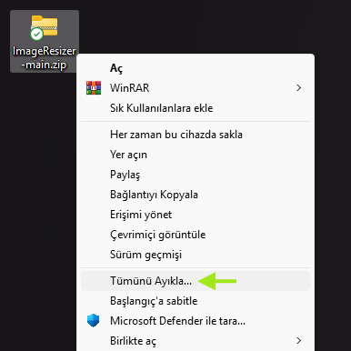

# Installation Guide

This guide will help you successfully install and run the program.

- [Step 1: Extract the ZIP File](#step-1-extract-the-zip-file)
- [Step 2: Running the Program and Creating a Desktop Shortcut](#step-2-running-the-program-and-creating-a-desktop-shortcut)
- [Step 3: Windows Defender Warnings](#step-3-windows-defender-warnings)
- [Frequently Asked Questions (FAQ)](#frequently-asked-questions-faq)
- [Developer Notes](#developer-notes)
- [Version History Table](#version-history-table)

## Step 1: Extract the ZIP File
- After downloading the ZIP file, right-click on it and select "Extract All."
\

- Choose a destination folder and click the "Extract" button.
- Alternatively, you can use applications like
**[WinRAR](https://www.win-rar.com/download.html?&L=5)** or
**[7-Zip](https://7-zip.org/download.html)** to extract the files.

## Step 2: Running the Program and Creating a Desktop Shortcut
- Navigate to the extracted folder and double-click the "resizer.exe" file to
launch the program.
- To create a desktop shortcut:
    1. Right-click on the 'resizer.exe' file.
    2. Select "Send to > Desktop (create shortcut)."  
    

## Step 3: Windows Defender Warnings
If Windows Defender displays a warning, follow these steps:
- Click on the "More Info" button on the warning screen.

- Select the "Run Anyway" option to proceed. The program is safe to use. For
more information, refer to the
"[Frequently Asked Questions (FAQ)](#frequently-asked-questions-faq)" section.  

## Frequently Asked Questions (FAQ)
- **Why am I receiving a security warning?**  
This is because the program is unsigned. It is safe to use, and you can bypass
the warning by selecting the "Run Anyway" option. For further details, you can
review the `resizer.py` file in the `raw` folder of the project or refer to 
the documentation in the `docs` folder.

## Developer Notes
- This document is prepared based on Windows 11. Similar steps apply to other
operating systems.
- You can share documentation gaps, detected bugs, or development suggestions
in the project comments section.

***Translation***  
\
*You can find the sources used for the translation below.*  
* [Google Translate](https://translate.google.com/?hl=en&sl=tr&tl=en&op=translate) 
* [ChatGPT](https://chatgpt.com/)

### Version History Table
| Version   | Date          | Contributor   | Description               |
|-----------|---------------|---------------|---------------------------|
| V0.0.0    | 15.01.2025    | Uruz          | Raw version of the document. |
| V0.0.1    | 15.01.2025    | Uruz          | First version of the document. |
